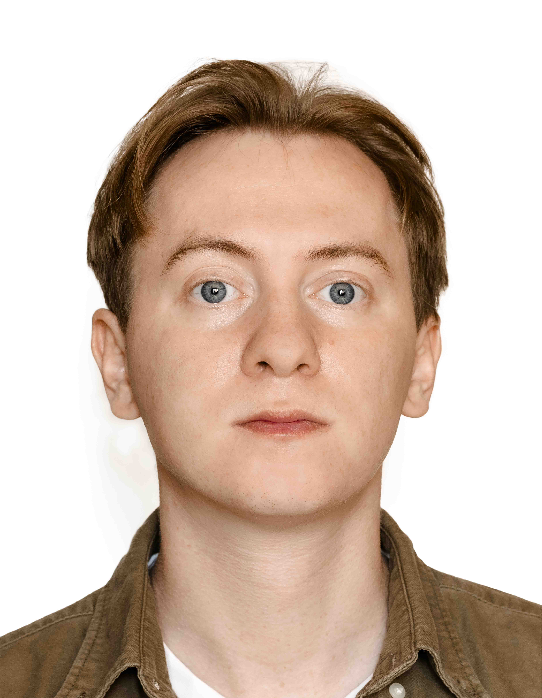

# ___CURRCULUM VITAE___ #
## 1. Personal Data ##
   - __Ruslan Zharinov__
   - __email:__ ruslanzharinov@gmail.com
## 2. Skills / Objective: ##
   Originally from Belarus, I have worked as an engineer-technologist in the aviation    repair plant and I have more than 2 years experience on this job. I have a second working profession at the plant: aircraft fitter (airframe and power plants). I had an internship at ALD Group company. I am responsible, decent, ability to work in a team. I seek to develop in the professional field. I have basic knowledge of the design and working of the engines, aircraft and helicopter designs. I want to continue my development in a technical area, gain new knowledge and skills.

## 3. My Code Example ##
  dfv

## 4. Education: ##
  _Institution Name:_ Belarusian State Aviation Academy  
     _Address:_ 77 Uborevich Street, Minsk, Belarus   
     _Speciality:_ technical exploitation of aircraft and engines   
     _Degree Earned:_ engineer   
     _Start and End Date:_ 2012-2018  
## 5. English Level ##
  B1